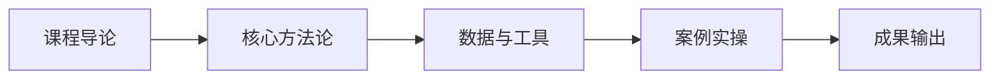

# L2A-06 试听样章：第 1 课时精选

> 免费试听 · 30 分钟
> 课时：2 课时
> 路径：L2-A 运营精进

---

## 课程定位

L2A-06 社媒内容运营与 KOL 合作是L2-A 运营精进路径的重要组成部分，TikTok 内容工业化 SOP、达人分层合作、直播转化。

## 第 1 课时核心知识点

### 1. 一、TikTok Shop 两种玩法

### 2. 二、三种经营模式

### 3. 三、内容工业化 SOP

## 核心数据与工具表

| 玩法 | 模式 | 适合卖家 |
|------|------|----------|
| 闭环成交 | TikTok 小店直接转化 | 有内容能力的卖家 |
| 无店内容跨境 | 短视频/直播引流到独立站/亚马逊 | 内容创作者 |

| 模式 | 特点 | 利润空间 | 运营难度 |
|------|------|----------|----------|
| 全托管 | 平台负责运营，卖家供货 | 低（供货价） | 低 |
| 半托管 | 卖家负责部分内容运营 | 中（高 15-25%） | 中 |
| 自运营 | 卖家完全自主运营 | 高 | 高 |

## 第 1 课时内容节选

### 第 1 课时：TikTok 内容工业化 SOP

### 一、TikTok Shop 两种玩法

| 玩法 | 模式 | 适合卖家 |
|------|------|----------|
| 闭环成交 | TikTok 小店直接转化 | 有内容能力的卖家 |
| 无店内容跨境 | 短视频/直播引流到独立站/亚马逊 | 内容创作者 |

### 二、三种经营模式

| 模式 | 特点 | 利润空间 | 运营难度 |
|------|------|----------|----------|
| 全托管 | 平台负责运营，卖家供货 | 低（供货价） | 低 |
| 半托管 | 卖家负责部分内容运营 | 中（高 15-25%） | 中 |
| 自运营 | 卖家完全自主运营 | 高 | 高 |

### 三、内容工业化 SOP

**四步流程：**
1. **策划**：卖点矩阵（功能 40%/场景 30%/对比 15%/UGC15%）
2. **制作**：日产 3-5 条，单条成本 50-100 元
3. **达人建联**：日均建联 20-30 位，转化率 5-10%
4. **直播**：每晚 4 场×1 小时，转化率 8%

**卖点矩阵详解：**
- **功能卖点**（40%）：产品核心功能、技术参数
- **场景卖点**（30%）：使用场景、解决痛点
- **对比卖点**（15%）：与竞品对比、升级点
- **UGC 卖点**（15%）：用户评价、真实反馈

## 学员常见问题

**Q1: 社媒内容运营与 KOL 合作的核心方法论是什么？**
A: 本课程采用"理论框架 + 真实数据 + 实操模板"三位一体教学法，每个知识点均配有可落地的工具模板。

**Q2: 学完本课程能输出什么成果？**
A: 完成本课程后，你将获得可直接应用于实际业务的策略框架和操作 SOP，以及配套的工具模板。

**Q3: 本课程适合什么基础的学员？**
A: 适合具备 1 年以上跨境电商经验，希望在运营精进方向系统提升的从业者。

## 学习路径

## 课后思考

1. 结合你目前的业务场景，思考"一、TikTok Shop 两种玩法"如何落地？
2. 对比你现有的做法，"二、三种经营模式"有哪些可以优化的空间？
3. 尝试用本课学到的方法，制定一个"三、内容工业化 SOP"的 90 天行动计划。

::: tip 课程特色
本课程注重**实战导向**，所有方法论均经过真实业务验证，配套工具模板即拿即用。
:::

<MarkDone id="l2a-06-sample" title="L2A-06 试听样章" />
