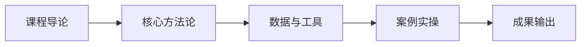

# L2A-08 试听样章：第 1 课时精选

> 免费试听 · 30 分钟
> 课时：2 课时
> 路径：L2-A 运营精进

---

## 课程定位

L2A-08 运营合规实操是L2-A 运营精进路径的重要组成部分，知识产权 SOP 五步法、合规日历化、TRO 应对。

## 第 1 课时核心知识点

### 1. 一、知识产权 SOP 五步

### 2. 二、合规日历化

### 3. 三、TRO 应对流程

## 核心数据与工具表

| 步骤 | 核心动作 | 时间 | 负责人 |
|------|----------|------|--------|
| 1. 商标注册 | 目标市场商标注册（美/欧/日） | 上架前 3-6 个月 | 法务/外部代理 |
| 2. 专利布局 | 外观专利 + 实用新型专利 | 产品开发阶段 | 研发 + 法务 |
| 3. 品牌备案 | 亚马逊 Brand Registry | 商标下证后 | 运营 |
| 4. 日常监控 | 竞品侵权监控、平台政策更新 | 每周 | 运营 + 法务 |
| 5. 应急响应 | TRO 应对、侵权投诉处理 | 24 小时内 | 法务 + 运营 |

## 第 1 课时内容节选

### 第 1 课时：知识产权 SOP 五步法

### 一、知识产权 SOP 五步

| 步骤 | 核心动作 | 时间 | 负责人 |
|------|----------|------|--------|
| 1. 商标注册 | 目标市场商标注册（美/欧/日） | 上架前 3-6 个月 | 法务/外部代理 |
| 2. 专利布局 | 外观专利 + 实用新型专利 | 产品开发阶段 | 研发 + 法务 |
| 3. 品牌备案 | 亚马逊 Brand Registry | 商标下证后 | 运营 |
| 4. 日常监控 | 竞品侵权监控、平台政策更新 | 每周 | 运营 + 法务 |
| 5. 应急响应 | TRO 应对、侵权投诉处理 | 24 小时内 | 法务 + 运营 |

**关键数据：** 2025 年中国企业在美涉跨境电商 IP 案件 2018 起，95.3% 为被告；商标诉讼平均判赔 70.82 万美元

### 二、合规日历化

**月度合规检查清单：**
- **每月 1 号**：检查账号健康度、政策更新
- **每月 15 号**：知识产权监控报告
- **每季度**：产品合规认证复审
- **每年**：商标续展、专利年费

### 三、TRO 应对流程

**TRO（临时禁令）应对五步：**
1. **确认收到**：24 小时内确认 TRO 通知
2. **评估影响**：冻结资金、下架 Listing 影响
3. **联系律师**：专业知识产权律师介入
4. **收集证据**：不侵权证据、先使用权证据
5. **和解/应诉**：评估和解成本 vs 应诉成本

**关键案例：** 107 家店铺因 Patrik Lovrin 闪粉肌理图 TRO 被诉，和解金平均每店$8,000-$15,000

## 学员常见问题

**Q1: 运营合规实操的核心方法论是什么？**
A: 本课程采用"理论框架 + 真实数据 + 实操模板"三位一体教学法，每个知识点均配有可落地的工具模板。

**Q2: 学完本课程能输出什么成果？**
A: 完成本课程后，你将获得可直接应用于实际业务的策略框架和操作 SOP，以及配套的工具模板。

**Q3: 本课程适合什么基础的学员？**
A: 适合具备 1 年以上跨境电商经验，希望在运营精进方向系统提升的从业者。

## 学习路径

## 课后思考

1. 结合你目前的业务场景，思考"一、知识产权 SOP 五步"如何落地？
2. 对比你现有的做法，"二、合规日历化"有哪些可以优化的空间？
3. 尝试用本课学到的方法，制定一个"三、TRO 应对流程"的 90 天行动计划。

::: tip 课程特色
本课程注重**实战导向**，所有方法论均经过真实业务验证，配套工具模板即拿即用。
:::

<MarkDone id="l2a-08-sample" title="L2A-08 试听样章" />
