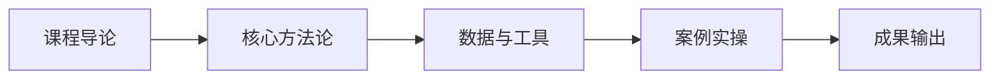

# L2A-09 试听样章：第 1 课时精选

> 免费试听 · 30 分钟
> 课时：2 课时
> 路径：L2-A 运营精进

---

## 课程定位

L2A-09 物流运营操作是L2-A 运营精进路径的重要组成部分，FBA 后台操作、头程物流选择、海外仓管理。

## 第 1 课时核心知识点

### 1. 一、FBA 后台操作 SOP

### 2. 二、头程物流选择

## 核心数据与工具表

| 方式 | 时效 | 成本 | 适用场景 |
|------|------|------|----------|
| 海运整柜 | 25-35 天 | 最低 | 大批量、非紧急 |
| 海运拼箱 | 30-40 天 | 低 | 中小批量 |
| 空运 | 5-10 天 | 高 | 紧急补货、高价值 |
| 铁路（中欧班列） | 15-20 天 | 中 | 欧洲市场、平衡时效成本 |

## 第 1 课时内容节选

### 第 1 课时：FBA 后台操作与头程物流

### 一、FBA 后台操作 SOP

**发货流程：**
1. **创建发货计划**：选择 SKU、数量、发货方式
2. **打印标签**：产品标签、外箱标签、托盘标签
3. **打包发货**：按 FBA 要求打包，贴标
4. **跟踪入仓**：跟踪物流进度，确认入仓
5. **库存管理**：监控库存水平，及时补货

**FBA 分仓策略：**
- 将货物分散至 5 个以上 FBA 仓，避免单仓爆仓风险
- 根据亚马逊仓点分布数据优化分仓

### 二、头程物流选择

| 方式 | 时效 | 成本 | 适用场景 |
|------|------|------|----------|
| 海运整柜 | 25-35 天 | 最低 | 大批量、非紧急 |
| 海运拼箱 | 30-40 天 | 低 | 中小批量 |
| 空运 | 5-10 天 | 高 | 紧急补货、高价值 |
| 铁路（中欧班列） | 15-20 天 | 中 | 欧洲市场、平衡时效成本 |

**头程物流选型三原则：**
1. **比价不比最低**：过低价格可能隐藏风险
2. **合同必签**：明确责任、赔偿条款
3. **货款分批付**：避免一次性预付过高比例

## 学员常见问题

**Q1: 物流运营操作的核心方法论是什么？**
A: 本课程采用"理论框架 + 真实数据 + 实操模板"三位一体教学法，每个知识点均配有可落地的工具模板。

**Q2: 学完本课程能输出什么成果？**
A: 完成本课程后，你将获得可直接应用于实际业务的策略框架和操作 SOP，以及配套的工具模板。

**Q3: 本课程适合什么基础的学员？**
A: 适合具备 1 年以上跨境电商经验，希望在运营精进方向系统提升的从业者。

## 学习路径

## 课后思考

1. 结合你目前的业务场景，思考"一、FBA 后台操作 SOP"如何落地？
2. 对比你现有的做法，"二、头程物流选择"有哪些可以优化的空间？

::: tip 课程特色
本课程注重**实战导向**，所有方法论均经过真实业务验证，配套工具模板即拿即用。
:::

<MarkDone id="l2a-09-sample" title="L2A-09 试听样章" />
