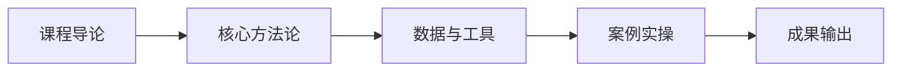

# L2B-02 试听样章：第 1 课时精选

> 免费试听 · 30 分钟
> 课时：3 课时
> 路径：L2-B 创业实战

---

## 课程定位

L2B-02 供应链从 0 搭建是L2-B 创业实战路径的重要组成部分，供应商管理体系、备份策略、MOQ 谈判与成本优化。

## 第 1 课时核心知识点

### 1. 一、单一供应商三大风险

### 2. 二、供应商评估四维打分表

## 核心数据与工具表

| 风险类型 | 具体表现 | 后果 |
|----------|----------|------|
| 交期风险 | 旺季产能被挤兑，无法优先排产 | 断货、FBA 上架延迟 |
| 品质风险 | 无对照、无制衡，品质下滑无备选 | 退货率飙升、差评 |
| 议价风险 | 唯一货源，被动接受涨价与 MOQ | 利润被压缩 |

| 维度 | 权重 | 评估指标 | 评分标准 |
|------|------|----------|----------|
| 品质 | 30% | 次品率、样品质量 | 次品率<2% 满分 |
| 交期 | 30% | 准时率、产能弹性 | 准时率≥95% 满分 |
| 价格 | 25% | 单价竞争力、付款条件 | 含 MOQ 灵活度 |
| 柔性 | 15% | 定制能力、响应速度 | 支持小批量起订 |

## 第 1 课时内容节选

### 第 1 课时：供应商管理体系

### 一、单一供应商三大风险

| 风险类型 | 具体表现 | 后果 |
|----------|----------|------|
| 交期风险 | 旺季产能被挤兑，无法优先排产 | 断货、FBA 上架延迟 |
| 品质风险 | 无对照、无制衡，品质下滑无备选 | 退货率飙升、差评 |
| 议价风险 | 唯一货源，被动接受涨价与 MOQ | 利润被压缩 |

**关键教训：** 永远不要只有一家供应商——"备份不是浪费，是保险"

### 二、供应商评估四维打分表

| 维度 | 权重 | 评估指标 | 评分标准 |
|------|------|----------|----------|
| 品质 | 30% | 次品率、样品质量 | 次品率<2% 满分 |
| 交期 | 30% | 准时率、产能弹性 | 准时率≥95% 满分 |
| 价格 | 25% | 单价竞争力、付款条件 | 含 MOQ 灵活度 |
| 柔性 | 15% | 定制能力、响应速度 | 支持小批量起订 |

## 学员常见问题

**Q1: 供应链从 0 搭建的核心方法论是什么？**
A: 本课程采用"理论框架 + 真实数据 + 实操模板"三位一体教学法，每个知识点均配有可落地的工具模板。

**Q2: 学完本课程能输出什么成果？**
A: 完成本课程后，你将获得可直接应用于实际业务的策略框架和操作 SOP，以及配套的工具模板。

**Q3: 本课程适合什么基础的学员？**
A: 适合具备 1 年以上跨境电商经验，希望在创业实战方向系统提升的从业者。

## 学习路径

## 课后思考

1. 结合你目前的业务场景，思考"一、单一供应商三大风险"如何落地？
2. 对比你现有的做法，"二、供应商评估四维打分表"有哪些可以优化的空间？

::: tip 课程特色
本课程注重**实战导向**，所有方法论均经过真实业务验证，配套工具模板即拿即用。
:::

<MarkDone id="l2b-02-sample" title="L2B-02 试听样章" />
