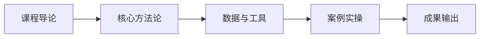

# L2B-07 试听样章：第 1 课时精选

> 免费试听 · 30 分钟
> 课时：2 课时
> 路径：L2-B 创业实战

---

## 课程定位

L2B-07 0-1 品牌启动与冷启动是L2-B 创业实战路径的重要组成部分，品牌画布、冷启动时间线、Listing 基建与内容冷启动。

## 第 1 课时核心知识点

### 1. 一、品牌资产五维价值

### 2. 二、品牌画布（Brand Canvas）

### 3. 三、竞品定位地图

## 核心数据与工具表

| 维度 | 价值体现 | 量化指标 |
|------|----------|----------|
| 认知资产 | 消费者主动搜索 | 品牌词流量占比 |
| 溢价资产 | 高于竞品定价 | 品牌溢价率 |
| 忠诚资产 | 复购与推荐 | 复购率、NPS |
| 知识产权 | 商标/专利壁垒 | 品牌保护覆盖度 |
| 传播资产 | 用户自发传播 | UGC 内容量 |

## 第 1 课时内容节选

### 第 1 课时：品牌定位与冷启动规划

### 一、品牌资产五维价值

**品牌是资产，不是费用：**
| 维度 | 价值体现 | 量化指标 |
|------|----------|----------|
| 认知资产 | 消费者主动搜索 | 品牌词流量占比 |
| 溢价资产 | 高于竞品定价 | 品牌溢价率 |
| 忠诚资产 | 复购与推荐 | 复购率、NPS |
| 知识产权 | 商标/专利壁垒 | 品牌保护覆盖度 |
| 传播资产 | 用户自发传播 | UGC 内容量 |

### 二、品牌画布（Brand Canvas）

**品牌画布一页纸模板（9 要素）：**
1. **目标人群**：谁买？画像、痛点、场景
2. **品类定位**：什么品类？细分赛道
3. **差异化价值**：为什么选你？
4. **价格策略**：定什么价？为什么？
5. **渠道策略**：在哪卖？
6. **品牌调性**：品牌个性/视觉风格
7. **内容策略**：用什么内容触达？
8. **关键指标**：怎么衡量成功？
9. **里程碑**：3-6-12 个月目标

### 三、竞品定位地图

**定位地图绘制步骤：**
1. 选定两个关键维度（如价格 × 品质感）
2. 标注竞品位置（5-8 个主要竞品）
3. 找出空白区域
4. 确定自身品牌定位坐标
5. 验证定位可行性

## 学员常见问题

**Q1: 0-1 品牌启动与冷启动的核心方法论是什么？**
A: 本课程采用"理论框架 + 真实数据 + 实操模板"三位一体教学法，每个知识点均配有可落地的工具模板。

**Q2: 学完本课程能输出什么成果？**
A: 完成本课程后，你将获得可直接应用于实际业务的策略框架和操作 SOP，以及配套的工具模板。

**Q3: 本课程适合什么基础的学员？**
A: 适合具备 1 年以上跨境电商经验，希望在创业实战方向系统提升的从业者。

## 学习路径

## 课后思考

1. 结合你目前的业务场景，思考"一、品牌资产五维价值"如何落地？
2. 对比你现有的做法，"二、品牌画布（Brand Canvas）"有哪些可以优化的空间？
3. 尝试用本课学到的方法，制定一个"三、竞品定位地图"的 90 天行动计划。

::: tip 课程特色
本课程注重**实战导向**，所有方法论均经过真实业务验证，配套工具模板即拿即用。
:::

<MarkDone id="l2b-07-sample" title="L2B-07 试听样章" />
