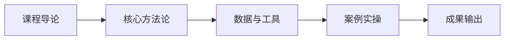

# L2C-02 试听样章：第 1 课时精选

> 免费试听 · 30 分钟
> 课时：3 课时
> 路径：L2-C 管理升级

---

## 课程定位

L2C-02 团队组织架构与绩效管理是L2-C 管理升级路径的重要组成部分，岗位体系设计、绩效机制、人效模型与人才培养。

## 第 1 课时核心知识点

### 1. 一、供应链五岗位体系

### 2. 二、组织架构升级方向

### 3. 三、分体量组织设计

## 核心数据与工具表

| 岗位 | 核心职责 | 三项核心 KPI |
|------|----------|-------------|
| 供应链负责人 | 统筹全链路 | 净利率、库存周转、断货率 |
| 采购上游岗 | 供应商管理 | 来料合格率、成本降幅、交期准时率 |
| 库存计划岗 | 预测与补货 | 预测准确率、断货率、呆滞占比 |
| 物流履约岗 | 头程+仓储 | 物流成本占比、入仓及时率 |
| 运营协同岗 | 销售同步 | 预测偏差率、备货达成率 |

| 维度 | 传统职能型 | 品类小前台 |
|------|-----------|-----------|
| 组织方式 | 按职能划分（运营/供应链/物流） | 按品类划分（小组全权负责） |
| 决策效率 | 低（跨部门协调） | 高（小组自治） |
| 责任归属 | 模糊（多部门推诿） | 清晰（品类负责人） |
| 适用体量 | <3000 万 | >3000 万 |

| 体量 | 组织架构 | 合规组织 |
|------|----------|----------|
| <10 人 | 兼任制（一人多岗） | 兼任合规责任人 |
| 10-50 人 | 职能制（专业分工） | 专职合规岗 |
| >50 人 | 矩阵制（品类+职能） | 合规部门+CCO |
| >1 亿 | 事业部制 | 独立合规团队 |

## 第 1 课时内容节选

### 第 1 课时：岗位体系与组织架构设计

### 一、供应链五岗位体系

| 岗位 | 核心职责 | 三项核心 KPI |
|------|----------|-------------|
| 供应链负责人 | 统筹全链路 | 净利率、库存周转、断货率 |
| 采购上游岗 | 供应商管理 | 来料合格率、成本降幅、交期准时率 |
| 库存计划岗 | 预测与补货 | 预测准确率、断货率、呆滞占比 |
| 物流履约岗 | 头程+仓储 | 物流成本占比、入仓及时率 |
| 运营协同岗 | 销售同步 | 预测偏差率、备货达成率 |

### 二、组织架构升级方向

**从职能型到品类小前台：**
| 维度 | 传统职能型 | 品类小前台 |
|------|-----------|-----------|
| 组织方式 | 按职能划分（运营/供应链/物流） | 按品类划分（小组全权负责） |
| 决策效率 | 低（跨部门协调） | 高（小组自治） |
| 责任归属 | 模糊（多部门推诿） | 清晰（品类负责人） |
| 适用体量 | <3000 万 | >3000 万 |

### 三、分体量组织设计

**"组织可以轻，责任不能空"**

| 体量 | 组织架构 | 合规组织 |
|------|----------|----------|
| <10 人 | 兼任制（一人多岗） | 兼任合规责任人 |
| 10-50 人 | 职能制（专业分工） | 专职合规岗 |
| >50 人 | 矩阵制（品类+职能） | 合规部门+CCO |
| >1 亿 | 事业部制 | 独立合规团队 |

**组织变革顺序：** "小团队先改 KPI，大团队先改架构，但两者最终都要做"

## 学员常见问题

**Q1: 团队组织架构与绩效管理的核心方法论是什么？**
A: 本课程采用"理论框架 + 真实数据 + 实操模板"三位一体教学法，每个知识点均配有可落地的工具模板。

**Q2: 学完本课程能输出什么成果？**
A: 完成本课程后，你将获得可直接应用于实际业务的策略框架和操作 SOP，以及配套的工具模板。

**Q3: 本课程适合什么基础的学员？**
A: 适合具备 1 年以上跨境电商经验，希望在管理升级方向系统提升的从业者。

## 学习路径

## 课后思考

1. 结合你目前的业务场景，思考"一、供应链五岗位体系"如何落地？
2. 对比你现有的做法，"二、组织架构升级方向"有哪些可以优化的空间？
3. 尝试用本课学到的方法，制定一个"三、分体量组织设计"的 90 天行动计划。

::: tip 课程特色
本课程注重**实战导向**，所有方法论均经过真实业务验证，配套工具模板即拿即用。
:::

<MarkDone id="l2c-02-sample" title="L2C-02 试听样章" />
