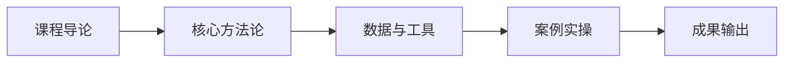

# L2C-03 试听样章：第 1 课时精选

> 免费试听 · 30 分钟
> 课时：3 课时
> 路径：L2-C 管理升级

---

## 课程定位

L2C-03 财务管控与经营分析是L2-C 管理升级路径的重要组成部分，成本结构与利润模型、财务三表、经营看板与预算管理。

## 第 1 课时核心知识点

### 1. 一、跨境电商全链路成本结构

### 2. 二、利润模型测算

## 核心数据与工具表

| 成本板块 | 占比 | 核心构成 |
|----------|------|----------|
| 采购成本 | 25-35% | 产品+包装+认证 |
| 供应链成本 | 20-30% | 头程+仓储+尾程（28.7% vs 国内 12.3%） |
| 平台成本 | 15-25% | 佣金+FBA 费+广告 |
| 运营成本 | 5-10% | 人工+工具+拍摄 |
| 合规成本 | 2-5% | 认证+税务+法务 |
| 退货损耗 | 3-5% | 退货率 19.3% |

| 平台 | 营收 | 总成本 | 净利润 | 净利率 |
|------|------|--------|--------|--------|
| 亚马逊 | $50 | $43 | $7 | 14% |
| TikTok | $50 | $45 | $5 | 10% |
| Temu | $50 | $48 | $2 | 4% |
| 独立站 | $50 | $40 | $10 | 20% |

## 第 1 课时内容节选

### 第 1 课时：成本结构与利润模型

### 一、跨境电商全链路成本结构

**成本占售价 90-97%，净利率仅 3-10%**

| 成本板块 | 占比 | 核心构成 |
|----------|------|----------|
| 采购成本 | 25-35% | 产品+包装+认证 |
| 供应链成本 | 20-30% | 头程+仓储+尾程（28.7% vs 国内 12.3%） |
| 平台成本 | 15-25% | 佣金+FBA 费+广告 |
| 运营成本 | 5-10% | 人工+工具+拍摄 |
| 合规成本 | 2-5% | 认证+税务+法务 |
| 退货损耗 | 3-5% | 退货率 19.3% |

**关键数据：** 供应链成本 28.7% 远高于国内电商 12.3%——供应链管控是利润关键

### 二、利润模型测算

**ROI 核心公式：**
- 盈亏平衡 ROI = 1 / 毛利率
- TACOS = 广告费 / 总营收（目标<15%）
- CAC = 获客总成本（独立站约$45 / 亚马逊 SP 约$20-35）
- LTV = 客户终身价值（LTV/CAC ≥ 3 健康）

**50 美元家居用品四平台利润对比：**
| 平台 | 营收 | 总成本 | 净利润 | 净利率 |
|------|------|--------|--------|--------|
| 亚马逊 | $50 | $43 | $7 | 14% |
| TikTok | $50 | $45 | $5 | 10% |
| Temu | $50 | $48 | $2 | 4% |
| 独立站 | $50 | $40 | $10 | 20% |

## 学员常见问题

**Q1: 财务管控与经营分析的核心方法论是什么？**
A: 本课程采用"理论框架 + 真实数据 + 实操模板"三位一体教学法，每个知识点均配有可落地的工具模板。

**Q2: 学完本课程能输出什么成果？**
A: 完成本课程后，你将获得可直接应用于实际业务的策略框架和操作 SOP，以及配套的工具模板。

**Q3: 本课程适合什么基础的学员？**
A: 适合具备 1 年以上跨境电商经验，希望在管理升级方向系统提升的从业者。

## 学习路径

## 课后思考

1. 结合你目前的业务场景，思考"一、跨境电商全链路成本结构"如何落地？
2. 对比你现有的做法，"二、利润模型测算"有哪些可以优化的空间？

::: tip 课程特色
本课程注重**实战导向**，所有方法论均经过真实业务验证，配套工具模板即拿即用。
:::

<MarkDone id="l2c-03-sample" title="L2C-03 试听样章" />
