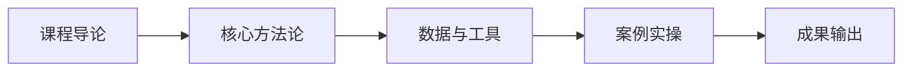

# L2C-04 试听样章：第 1 课时精选

> 免费试听 · 30 分钟
> 课时：3 课时
> 路径：L2-C 管理升级

---

## 课程定位

L2C-04 全链路风控体系搭建是L2-C 管理升级路径的重要组成部分，合规组织架构、8 大 SOP、风险矩阵与应急响应。

## 第 1 课时核心知识点

### 1. 一、三层合规体系架构

### 2. 二、8 大核心 SOP

## 核心数据与工具表

| 层级 | 角色 | 职责 |
|------|------|------|
| 治理层 | CCO/合规委员会 | 战略方向、资源审批、重大决策 |
| 管理层 | 合规部门 | 制度流程、培训监督、风险监测 |
| 执行层 | 业务对接人 | 日常执行、异常上报、SOP 落地 |

| SOP 编号 | SOP 名称 | 优先级 | 落地顺序 |
|----------|----------|--------|----------|
| SOP-1 | 新品上架合规审查 | P0 | 第 1 批 |
| SOP-2 | 订单履约合规 | P0 | 第 1 批 |
| SOP-3 | 知识产权监控 | P1 | 第 2 批 |
| SOP-4 | 产品合规认证管理 | P1 | 第 2 批 |
| SOP-5 | 数据隐私合规 | P1 | 第 2 批 |
| SOP-6 | 广告素材合规审查 | P2 | 第 3 批 |
| SOP-7 | 供应商合规管理 | P2 | 第 3 批 |
| SOP-8 | 应急响应与危机处理 | P2 | 第 3 批 |

## 第 1 课时内容节选

### 第 1 课时：合规组织架构与 SOP

### 一、三层合规体系架构

| 层级 | 角色 | 职责 |
|------|------|------|
| 治理层 | CCO/合规委员会 | 战略方向、资源审批、重大决策 |
| 管理层 | 合规部门 | 制度流程、培训监督、风险监测 |
| 执行层 | 业务对接人 | 日常执行、异常上报、SOP 落地 |

**组织规模适配原则：**
- "组织可以轻，责任不能空"
- 10 人以下：兼任合规责任人（三件事：知产监控+产品合规+平台规则）
- 1 亿以上：专职合规团队
- "没有 CEO 背书的体系推不动"——治理层必须有一把手参与

### 二、8 大核心 SOP

| SOP 编号 | SOP 名称 | 优先级 | 落地顺序 |
|----------|----------|--------|----------|
| SOP-1 | 新品上架合规审查 | P0 | 第 1 批 |
| SOP-2 | 订单履约合规 | P0 | 第 1 批 |
| SOP-3 | 知识产权监控 | P1 | 第 2 批 |
| SOP-4 | 产品合规认证管理 | P1 | 第 2 批 |
| SOP-5 | 数据隐私合规 | P1 | 第 2 批 |
| SOP-6 | 广告素材合规审查 | P2 | 第 3 批 |
| SOP-7 | 供应商合规管理 | P2 | 第 3 批 |
| SOP-8 | 应急响应与危机处理 | P2 | 第 3 批 |

**落地原则：** 新品上架→订单履约优先，其余按业务触点排序

## 学员常见问题

**Q1: 全链路风控体系搭建的核心方法论是什么？**
A: 本课程采用"理论框架 + 真实数据 + 实操模板"三位一体教学法，每个知识点均配有可落地的工具模板。

**Q2: 学完本课程能输出什么成果？**
A: 完成本课程后，你将获得可直接应用于实际业务的策略框架和操作 SOP，以及配套的工具模板。

**Q3: 本课程适合什么基础的学员？**
A: 适合具备 1 年以上跨境电商经验，希望在管理升级方向系统提升的从业者。

## 学习路径

## 课后思考

1. 结合你目前的业务场景，思考"一、三层合规体系架构"如何落地？
2. 对比你现有的做法，"二、8 大核心 SOP"有哪些可以优化的空间？

::: tip 课程特色
本课程注重**实战导向**，所有方法论均经过真实业务验证，配套工具模板即拿即用。
:::

<MarkDone id="l2c-04-sample" title="L2C-04 试听样章" />
