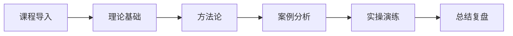

# L2C-04 试听样章：课程导论与核心方法

> 免费试听 · 30分钟  
> 适用人群：团队管理者或准备晋升管理层，需要提升管理能力的专业人士

---

## 课程概览

### 课程定位

全链路风控体系搭建是L2进阶专业层的重要组成部分，面向具备一定基础的学员，深入探讨管理升级核心方法。

### 核心收益

学完本课程你将能够：
1. 掌握管理体系构建与优化
2. 理解团队领导与激励
3. 应用战略规划与执行
4. 建立组织能力建设

### 适合人群

团队管理者或准备晋升管理层，需要提升管理能力的专业人士

---

## 核心知识点预览

### 一、管理体系构建

**核心概念**：[简要介绍核心概念]

**应用场景**：[实际应用案例]

**关键指标**：[衡量标准]

### 二、团队领导艺术

**核心概念**：[简要介绍核心概念]

**应用场景**：[实际应用案例]

**关键指标**：[衡量标准]

### 三、战略执行方法

**核心概念**：[简要介绍核心概念]

**应用场景**：[实际应用案例]

**关键指标**：[衡量标准]

---

## 实战案例片段

### 案例背景

[简短的真实案例背景介绍]

### 问题分析

1. **问题1**：[具体问题]
2. **问题2**：[具体问题]
3. **问题3**：[具体问题]

### 解决方案

[简要的解决思路和方法]

---

## 学习路径图

---

## Q&A 预案

**Q1: 学员常见问题1?**  
A: [详细回答，结合实际案例]

**Q2: 学员常见问题2?**  
A: [详细回答，结合实际案例]

**Q3: 学员常见问题3?**  
A: [详细回答，结合实际案例]

---

## 课后思考

1. **思考题1**：[引导性问题]
2. **思考题2**：[引导性问题]
3. **思考题3**：[引导性问题]

::: tip 课程特色
本课程注重**实战导向**，理论与实践相结合，通过大量真实案例和实操演练，帮助学员快速掌握核心技能。
:::

<MarkDone id="c04-sample" title="L2C-04 试听样章" />
