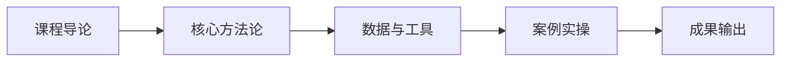

# L2C-05 试听样章：第 1 课时精选

> 免费试听 · 30 分钟
> 课时：3 课时
> 路径：L2-C 管理升级

---

## 课程定位

L2C-05 供应链战略与库存管理是L2-C 管理升级路径的重要组成部分，供应链战略定位、混合履约战略、库存周转与风险管控。

## 第 1 课时核心知识点

### 1. 一、从成本中心到核心竞争力

### 2. 二、分层混合履约战略

## 核心数据与工具表

| 阶段 | 定位 | 核心指标 |
|------|------|----------|
| 1.0 | 成本中心 | 采购成本最低 |
| 2.0 | 效率引擎 | 周转最快、断货最少 |
| 3.0 | 核心竞争力 | 供应链能力决定平台流量与准入 |

| SKU 等级 | 履约方式 | 库存策略 | 目标 |
|----------|----------|----------|------|
| A 类（≥60% 营收） | 海外仓主力 | 安全库存 120% | 保供 |
| B 类（25-60%） | 小批量试备 | 安全库存 100% | 试水 |
| C 类（5-25%） | 仅直发 | 安全库存 80% | 轻库存 |
| D 类（<5%） | 清退 | 不补货 | 释放资金 |

## 第 1 课时内容节选

### 第 1 课时：供应链战略定位

### 一、从成本中心到核心竞争力

**供应链战略价值演进：**
| 阶段 | 定位 | 核心指标 |
|------|------|----------|
| 1.0 | 成本中心 | 采购成本最低 |
| 2.0 | 效率引擎 | 周转最快、断货最少 |
| 3.0 | 核心竞争力 | 供应链能力决定平台流量与准入 |

**标杆案例：**
- SHEIN：柔性供应链 = 核心壁垒（小单快反、7 天上新）
- 致欧科技：供应链效率 = 利润来源（4.6% 净利率）
- 赛维时代：供应链规模 = 品类覆盖（多品牌矩阵）

### 二、分层混合履约战略

**ABCD SKU 差异化履约策略：**
| SKU 等级 | 履约方式 | 库存策略 | 目标 |
|----------|----------|----------|------|
| A 类（≥60% 营收） | 海外仓主力 | 安全库存 120% | 保供 |
| B 类（25-60%） | 小批量试备 | 安全库存 100% | 试水 |
| C 类（5-25%） | 仅直发 | 安全库存 80% | 轻库存 |
| D 类（<5%） | 清退 | 不补货 | 释放资金 |

## 学员常见问题

**Q1: 供应链战略与库存管理的核心方法论是什么？**
A: 本课程采用"理论框架 + 真实数据 + 实操模板"三位一体教学法，每个知识点均配有可落地的工具模板。

**Q2: 学完本课程能输出什么成果？**
A: 完成本课程后，你将获得可直接应用于实际业务的策略框架和操作 SOP，以及配套的工具模板。

**Q3: 本课程适合什么基础的学员？**
A: 适合具备 1 年以上跨境电商经验，希望在管理升级方向系统提升的从业者。

## 学习路径

## 课后思考

1. 结合你目前的业务场景，思考"一、从成本中心到核心竞争力"如何落地？
2. 对比你现有的做法，"二、分层混合履约战略"有哪些可以优化的空间？

::: tip 课程特色
本课程注重**实战导向**，所有方法论均经过真实业务验证，配套工具模板即拿即用。
:::

<MarkDone id="l2c-05-sample" title="L2C-05 试听样章" />
