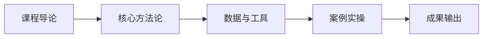

# L2C-06 试听样章：第 1 课时精选

> 免费试听 · 30 分钟
> 课时：2 课时
> 路径：L2-C 管理升级

---

## 课程定位

L2C-06 品牌战略与全域增长管理是L2-C 管理升级路径的重要组成部分，品牌健康度评分卡、全域增长框架、营销预算与品牌估值。

## 第 1 课时核心知识点

### 1. 一、品牌健康度评分卡

### 2. 二、三大核心指标管理基准

### 3. 三、全域增长管理框架

## 核心数据与工具表

| 指标 | 权重 | 健康标准 | 预警线 |
|------|------|----------|--------|
| 品牌词流量占比 | 25% | ≥15% | <8% |
| LTV/CAC | 25% | ≥3 | <2 |
| 复购率 | 20% | 品类基准上限 | 品类基准下限 |
| 毛利率 | 15% | ≥40% | <30% |
| 自然流量占比 | 10% | ≥30% | <15% |
| 合规风险 | 5% | 零风险 | 有预警 |

| 阶段 | 占比 | 含义 |
|------|------|------|
| 初创 | 0-5% | 品牌认知起步 |
| 成长 | 5-15% | 初步心智建立 |
| 成熟 | 15-25% | 品牌心智成熟 |
| 头部 | 30-50% | 品牌成为核心流量来源 |

| 渠道 | 角色 | 预算占比 | KPI |
|------|------|----------|-----|
| 亚马逊 SP/SB | 转化 | 40-50% | ACOS/TACOS |
| TikTok 内容 | 种草 | 20-30% | 曝光/互动 |
| Google/Meta | 拉新 | 10-20% | CAC |
| EDM/私域 | 留存 | 5-10% | 复购率 |

## 第 1 课时内容节选

### 第 1 课时：品牌健康度与全域增长

### 一、品牌健康度评分卡

**六指标权重结构：**
| 指标 | 权重 | 健康标准 | 预警线 |
|------|------|----------|--------|
| 品牌词流量占比 | 25% | ≥15% | <8% |
| LTV/CAC | 25% | ≥3 | <2 |
| 复购率 | 20% | 品类基准上限 | 品类基准下限 |
| 毛利率 | 15% | ≥40% | <30% |
| 自然流量占比 | 10% | ≥30% | <15% |
| 合规风险 | 5% | 零风险 | 有预警 |

**判定标准：** ≥80 健康 / 60-80 关注 / <60 预警

### 二、三大核心指标管理基准

**品牌词流量占比基准：**
| 阶段 | 占比 | 含义 |
|------|------|------|
| 初创 | 0-5% | 品牌认知起步 |
| 成长 | 5-15% | 初步心智建立 |
| 成熟 | 15-25% | 品牌心智成熟 |
| 头部 | 30-50% | 品牌成为核心流量来源 |

**关键节点：** 8% = 初步心智，15% = 成熟标志

**LTV/CAC 管理：**
- ≥3 健康、<2 熔断
- CAC 渠道基准：独立站约$45 / 亚马逊 SP 约$20-35 / TikTok KOL 驱动约$15-30

**复购率品类基准：**
- 快消 15-25% / 3C 8-15% / 家居 10-18% / 美妆 20-35%

### 三、全域增长管理框架

**渠道预算分配模型：**
| 渠道 | 角色 | 预算占比 | KPI |
|------|------|----------|-----|
| 亚马逊 SP/SB | 转化 | 40-50% | ACOS/TACOS |
| TikTok 内容 | 种草 | 20-30% | 曝光/互动 |
| Google/Meta | 拉新 | 10-20% | CAC |
| EDM/私域 | 留存 | 5-10% | 复购率 |

## 学员常见问题

**Q1: 品牌战略与全域增长管理的核心方法论是什么？**
A: 本课程采用"理论框架 + 真实数据 + 实操模板"三位一体教学法，每个知识点均配有可落地的工具模板。

**Q2: 学完本课程能输出什么成果？**
A: 完成本课程后，你将获得可直接应用于实际业务的策略框架和操作 SOP，以及配套的工具模板。

**Q3: 本课程适合什么基础的学员？**
A: 适合具备 1 年以上跨境电商经验，希望在管理升级方向系统提升的从业者。

## 学习路径

## 课后思考

1. 结合你目前的业务场景，思考"一、品牌健康度评分卡"如何落地？
2. 对比你现有的做法，"二、三大核心指标管理基准"有哪些可以优化的空间？
3. 尝试用本课学到的方法，制定一个"三、全域增长管理框架"的 90 天行动计划。

::: tip 课程特色
本课程注重**实战导向**，所有方法论均经过真实业务验证，配套工具模板即拿即用。
:::

<MarkDone id="l2c-06-sample" title="L2C-06 试听样章" />
